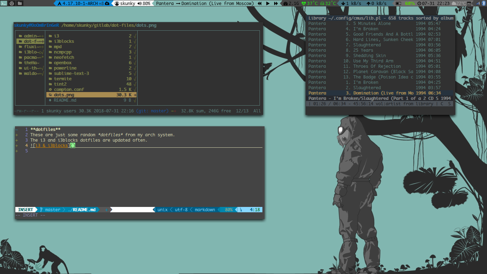

**dotfiles**  
These are just some random *dotfiles* from my arch system.  
All scripts are written in bash.  
The i3 and i3blocks dotfiles are updated often.  
i3blocks are located in scripts folder.  
  
Termite configs have a few colorschemes included as well.  

**Scripts**  
These scripts are ones I am using for i3blocks. The file names are  
mostly self explanitory.  

*diskTemp*  
Outputs hdd current temp. Uses hddtemp in the script. Uses pango markup.  
Output color changes as temp rises. Change heat ranges as needed based on  
current hardware specs.  

*Heat*  
This script outputs average core temp. Again colors change based on heat level.  

*cmus-blocks*  
This block displays the current song playing in cmus.  

*playpause*  
This script displays play/pause button in block. Block starts out with square  
"stopped" symbol. Once clicked, it changes to a play symbol, if clicked again,  
it will change to pause symbol.  

*Next + prev*  
Same as above except these output next and back buttons on either side of the  
play/pause button. Using seperate scripts because I could not figure out how  
to do this all in one script in bash.

*Batt1/batt2*  
What the title says. Batt1 outputs battery percent. Color coded to charge level.  
batt2 outputs battery icon, also color coded to charge level.  

*Updates*  
This script displays number of pacman updates in the block in the form of "+n"  
where "n" is the number of updates.  
